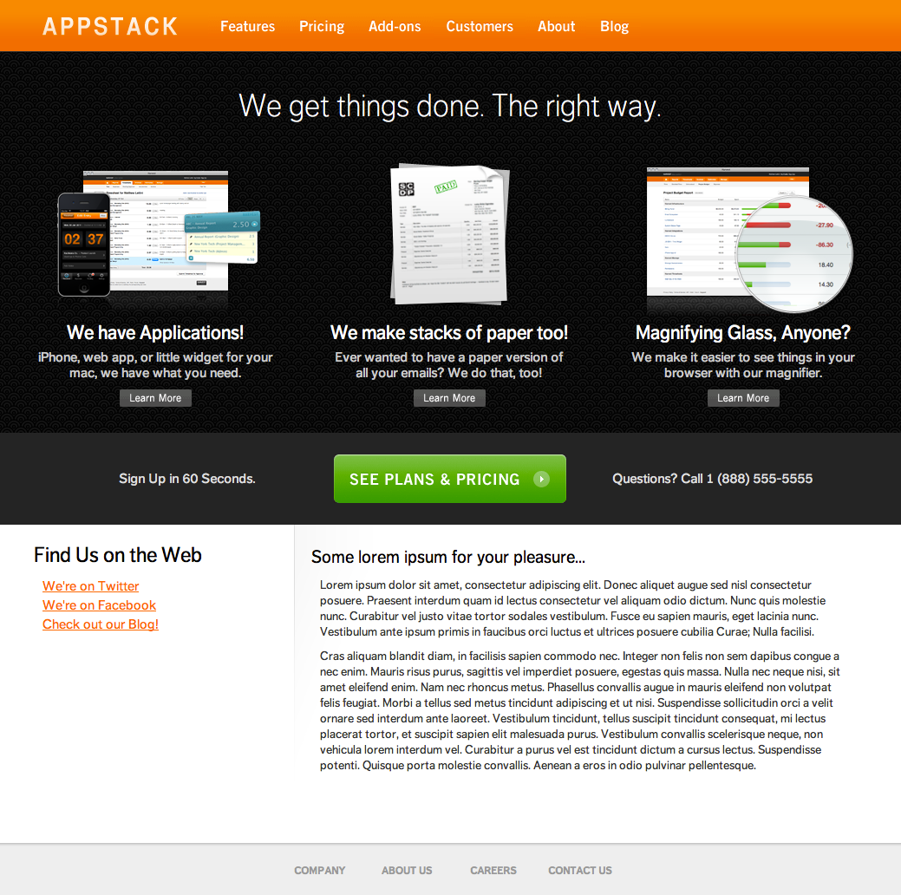
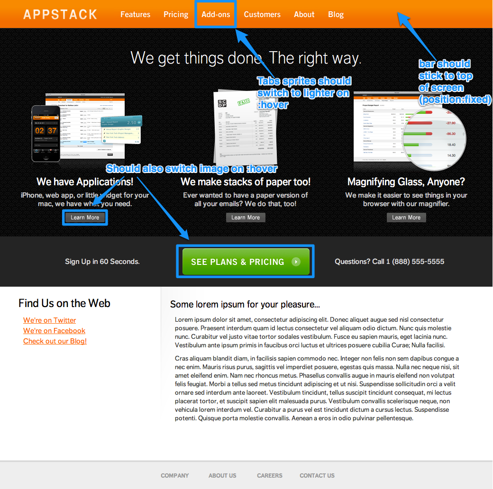

# Assignment One: HTML/CSS
## Due: February 6th, 2013 @ 11:59pm
This is a multi-part assignment with the objective of making you comfortable working with HTML and CSS. By the end of this assignment, you will have styled the HTML of a standard, but complex, website home page, and created a website of your own.

**Note:** Only CSS and HTML need to be used for this assignment. If you're using JavaScript (or libraries such as jQuery), you might be thinking a little too hard about how to do this.

**Note 2:** If you've never had a CS account before, one has been set up for you (provided you were enrolled in the class through Banner as of last night). You should visit the Sunlab (CIT 143) and talk to the consultant on duty (the student sitting at the first computer when you walk in) about setting up your account. TAs are also available to help you through this process.

**Note 3:** If this assignment seems overwhelming to you, please come see a TA on hours to talk through some strategies for tackling it. This assignment has been designed so that it is feasible for both concentrators and non-concentrators to complete in a reasonable amount of time.

### Important Things to Understand
* What is the "Box Model"?
* What is a CSS Selector? What is the difference between `id` and `class` attributes?
* What does the CSS `position: fixed` do?
* What are image sprites? Know how to move sprites with the `background-position` attribute.
* What are CSS pseudo-classes?

    For `a` link tags (i.e., `a:hover`, `a:active`, `a:visited`) as well as generally (with `:lastchild`).
* What's are the differences between `display: inline`, `display: block`, and `display: inline-block`?

## Part One: The Problem
Your client, the Appstack Corporation, has come to you with their unfinished website. They've taken the time to generate a simple HTML file with the content of their website, and they've hired a designer to produce a mockup for the final site, but they don't have any CSS experts on their payroll. They want to hire you to take their HTML and mockups, and write the CSS that accomplishes their desired design.

## Part One: Specifications
Using CSS, style `appstack.html` to look like the image mockup below **without** modifying `appstack.html`. You'll definitely want to *click the mockup* to view it at its full resolution.

You should make sure that the page's main container remains horizontally centered in the browser window, and the navigation bar should stick to the top of the screen when scrolling (for examples, see [facebook.com](http://facebook.com) and [techcrunch.com](http://techcrunch.com)).

All image links should have hover actions according to the annotated mock-up below (*and make sure to click through to see it in full size*).

Hint: As you might notice in looking through the stencil code, the navigation bar buttons are an image sprite (if that sounds like a foreign concept, check out [the last few slides in Matt's CSS lecture](http://cs.brown.edu/courses/csci1320/lectures/cs132lectCSS.pdf)). To make your life easier, we've calculated certain attributes for the sprites that you might find useful:

* "Unhovered" buttons: `background-position: xxx 0;`
* "Hover" buttons: `background-position: xxx -59px;`
* Features Button: `width: 90px; background-position: 0 0;`
* Pricing Button: `width: 80px; background-position: -91px 0;`
* Addons Button: `width: 90px; background-position: -172px 0;`
* About Button: `width: 72px; background-position: -263px 0;`
* Customers Button: `width: 105px; background-position: -437px 0;`
* Blog Button: `width: 65px; background-position: -543px 0;`

Note: While we don't require pixel perfect accuracy in this assignment, your styled webpage must be consistent on both Chrome and Firefox. To access the latest versions of each browser available in the department:

* Firefox: From the command-line, type 'firefox_stable'. Note that Iceweasel, the department's default browser, is not an acceptable substitute.
* Chrome: From the command-line, type 'google-chrome'.

## Part One: Getting Started
Create a new directory to hold your project's files (e.g., `mkdir html`), change into it (e.g., `cd html`), and then run:

    cs132_install html

If you don't have a CS account yet, you can download a copy of the project from GitHub: [https://github.com/brown-cs132-s13/html/archive/master.zip](https://github.com/brown-cs132-s13/html/archive/master.zip).

This will setup your project with a selection of images, fonts, and a minimal CSS file in which you'll implement the project.

Any images you'll need can be found in the `images` folder, which in your CSS, can be referenced as `../images` (when CSS is in its own file, URLs are relative to the CSS file, not the page it's loaded on). All of your CSS should go in the `style_base.css` file, which can be found in the `css` folder.

**Do not edit** `appstack.html` under any circumstances -- you should only need to make changes to `style_base.css`.

## Part Two: The Problem
There are two options for completing the second part of this assignment: you can either create your own personal web page, or create a new CS132 course website.

You're on your own for this one. Use Part 1 and the resources provided on the course website for references in your work. **Hint: Do Part 1 before you do Part 2**.

## Part Two: Specifications

#### Option 1: Personal Website
Your website needs a home page, 3-5 linked pages, and a navigation bar that connects it all together. Feel free to get creative with it. Your hand-in should be comparable in complexity to the current CS132 course website (minus the game at the top).

#### Option 2: New CS132 Course Website
Your website should have a clearly-displayed title image and logo that includes the text "CS132: Creating Modern Web Applications". You'll need to have separate pages for the following topics, including the current data from the course website:

* News
* Staff
* Assignments
* Resources
* Projects

You should have a navigation bar that links to each of those pages.

## Troubleshooting
If you're having problems, you can always talk to the friendly and talented TAs. We're available from 7-9pm on Mondays, Wednesdays, and Thursdays in the Moonlab (CIT 227), and can be reached via email at [cs132tas@cs.brown.edu](mailto:cs132tas@cs.brown.edu).

## Handing In
To hand in your project, from your project directory, run:

    cs132_handin html

**Note:** if the handin script isn't working for you, you can email a copy of your code to the TAs.

That's it!
